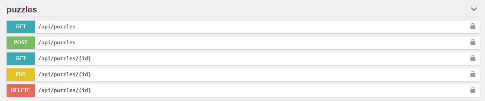
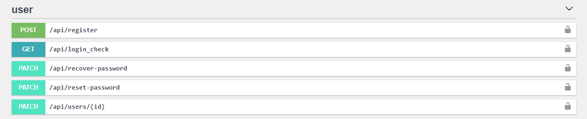

# Guess movie REST API
The goal of this API is to provide backend for <b>[Guess movie](https://guess-movie.tech)</b> game.

# Live demo
Check out <b>[swagger documentation](https://guess-movie-api.milenaportfolio.pl/api/doc)</b> and make some requests.

# Features
This is a simple managing app, which is implemented as REST API which uses JWT (JSON Web Token) tokens to access various endpoints. You can get puzzles, add new puzzle, modify some particular puzzle or remove it.
[](https://guess-movie-api.milenaportfolio.pl/api/doc)<br>

Also there are some basic endpoints to manage user.
[](https://guess-movie-api.milenaportfolio.pl/api/doc)

## Responses
Guess movie API uses conventional HTTP response codes to indicate the success or failure of an API request.

## Authentication
Authentication for the Guess movie API endpoints is done using a bearer token. The bearer token is generated and returned after successfully login. API requests without authentication will fail. <br>
All API requests must be made over HTTPS. Calls made over plain HTTP will fail. 


### Users
You can simply register new user account or you can use an example credentials:<br>
```
login: user@example.com
password: 123456  
```

There is no possibility to create user with administrative permissions directly by the API. 
If you want to check an administrative endpoints you can use following credentials: <br>
```
login: admin@example.com
password: 123456 
``` 


# Technologies
This project is made with <b>[Symfony 5.2](https://symfony.com)</b> Framework and following libraries:
- [Doctrine ORM](https://symfony.com/doc/current/doctrine.html)
- [LexikJWTAuthenticationBundle](https://github.com/lexik/LexikJWTAuthenticationBundle)
- [NelmioApiDocBundle](https://symfony.com/bundles/NelmioApiDocBundle/current/index.html)
- [Symfony Mailer](https://symfony.com/doc/5.2/mailer.html)
- [REST Bundle](https://packagist.org/packages/friendsofsymfony/rest-bundle)
- [NelmioCorsBundle](https://github.com/nelmio/NelmioCorsBundle)

### Frontend
- Frontend for this project is made with [Vue.js 3](https://vuejs.org).
- Check out <b>[frontend repository](https://github.com/miKlepczuk/guess-movie-front)</b> of this project.


# Requirements
- Standard [Symfony requirements](https://symfony.com/doc/5.2/setup.html) 
- PHP 8.0 or higher
- MySQL 5.6 / MariaDB 10.4 or higher 


# Project setup
To run Guess movie API locally, you can clone this repository and follow the instructions. 

```
$ composer install
``` 

### Configure your Environment Variables
```
# Generate an optimized .env.local.php:
$ composer dump-env dev
```

Set environment variables, depends on your setup, especially following variables: 
``` 
DATABASE_URL
MAILER_SENDER_NAME
MAILER_SENDER_EMAIL
FRONTEND_URL
BACKEND_URL
```
### Generate private and public keys to generate JWT
Modify ```JWT_PASSPHRASE``` environment variable and generate keys using an [OpenSSL](https://www.openssl.org/source) toolkit:

```
$ mkdir config/jwt
$ openssl genrsa -out config/jwt/private.pem -aes256 4096
$ openssl rsa -pubout -in config/jwt/private.pem -out config/jwt/public.pem
```

### Setup database
```
$ php bin/console doctrine:database:create
$ php bin/console doctrine:schema:update --force
```

### Load fixtures
If you want to run application using some example data run following command:

```
$ php bin/console doctrine:fixtures:load -n -q 
```


# License
This project is under MIT license. Copyright © 2021 [Milena Klepczuk](https://github.com/miKlepczuk).

# Feedback
If you have any feedback, please send me an <a href="mailto:milena.klepczuk@gmail.com">email</a> or drop an issue on GitHub. Any feedback is welcome and greatly appreciated.
